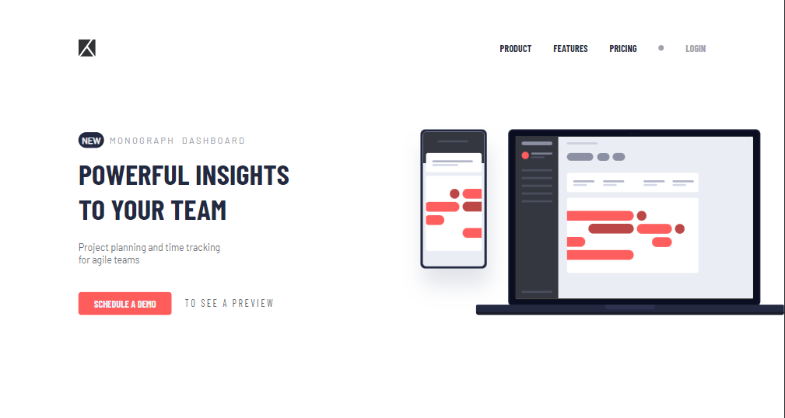
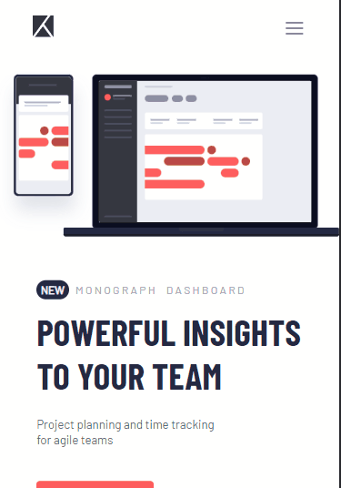

# Desafio Apresentação de Dashboard - Frontend-Mentor

Este é um desafio de Apresentação de Dashboard proposto pelo site Frontend-Mentor.

## Tabela de Conteúdos

- [Visão Geral](#visão-geral)
    - [Imagens](#imagens)
    - [Link da página](#link)
- [Processo](#processo)
    - [Linguagens utilizadas](#linguagens-utilizadas)
    - [O que aprendi](#o-que-aprendi)
    - [Possíveis evoluções](#possíveis-evoluções)
- [Autor](#autor)

## Visão-geral

### Imagens

<br>

````
Versão de Desktop
````

   

<br>

````
Versão Mobile
````

 

### Link

- Página no GitHub Pages: <a href="https://julio-mansan2.github.io/apresentacao-dashboard">Clique aqui!</a>

## Processo

### Linguagens utilizadas

<br>

- Marcações semânticas de HTML5
- Propriedades de customização do CSS3
- Estruturas de JavaScript

<br>

### O que aprendi

<br>

- Utilizar espaçamento (&nbsp):

````html

<span>t o &nbsp s e e &nbsp a &nbsp p r e v i e w</span>

````

- Criar um menu hambúrguer:

````html

<input id="menu-hamburguer" type="checkbox" />

<input id="menu__toggle" type="checkbox" />
<label class="menu__btn" for="menu__toggle">
<span></span>
</label>

````
````css

#menu__toggle {
        opacity: 0;
      }
      #menu__toggle:checked + .menu__btn > span {
        transform: rotate(45deg);
      }
      #menu__toggle:checked + .menu__btn > span::before {
        top: 0;
        transform: rotate(0deg);
      }
      #menu__toggle:checked + .menu__btn > span::after {
        top: 0;
        transform: rotate(90deg);
      }
      #menu__toggle:checked ~ .menu__box {
        right: 15%;
      }
      .menu__btn {
        position: relative;
        top: 15px;
        right: 10%;
        width: 1.6rem;
        height: 1.6rem;
        cursor: pointer;
        z-index: 2;
      }
      .menu__btn > span,
      .menu__btn > span::before,
      .menu__btn > span::after {
        display: block;
        position: absolute;
        width: 100%;
        height: 2px;
        background-color: #616161;
        transition-duration: .25s;
      }
      .menu__btn > span::before {
        content: '';
        top: -0.5rem;
      }
      .menu__btn > span::after {
        content: '';
        top: 0.5rem;
      }
      .menu__box {
        display: flex;
        position: fixed;
        flex-direction: column;
        top: 13%;
        margin: 0;
        width: 70%;
        right: -100%;
        padding: 30px;
        list-style: none;
        background-color: #ECEFF1;
        box-shadow: 2px 2px 6px rgba(0, 0, 0, .4);
        z-index: 1;
      }


````
<br>

### Possíveis evoluções

<br>

- Códigos mais compactos;
- Posicionar a imagem à direita, de forma que a tela não a acompanhe;
- Utilizar menos medidas manuais.

<br>

## Autor

GitHub - <a href="https://github.com/julio-mansan2">julio-mansan2</a> <br>
Front-end Mentor - <a href="https://www.frontendmentor.io/profile/julio-mansan2">julio-mansan2</a> <br>
LinkedIn - <a href="https://www.linkedin.com/in/j%C3%BAlio-a-mansan-3415a7249/">Júlio A.</a> <br>